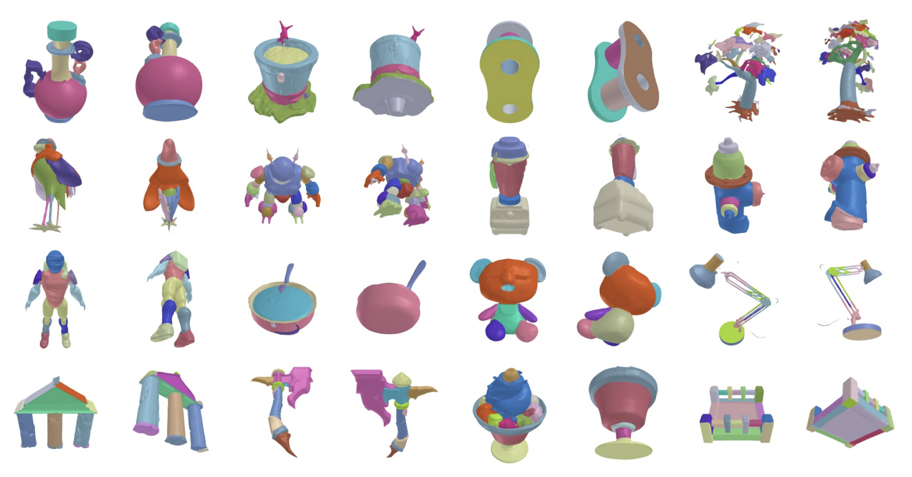
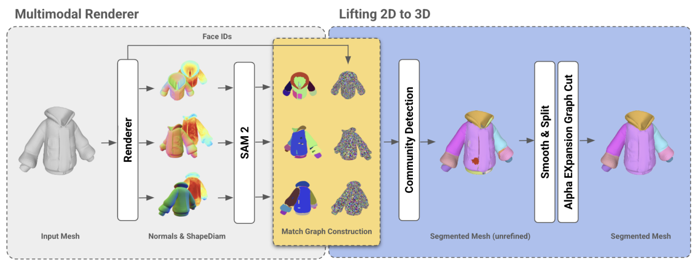
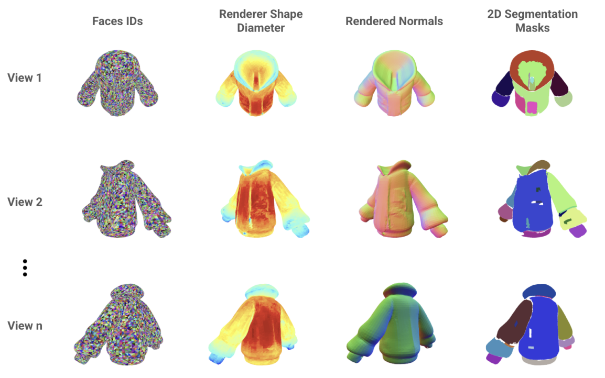

# Segment Any Mesh

> **Note about this branch**  
> This branch was created through **Code Vibe** in pure experimentation. It extends the original SAMesh codebase with multiple SAM model support (SAM2 + SAM3), a Gradio app, intelligent prompt agents, and hybrid segmentation strategies. Expect experimental features and evolving APIs.

---

[Segment Any Mesh](https://arxiv.org/abs/2408.13679) (SAMesh) is a novel zero-shot method for mesh part segmentation that addresses the limitations of traditional shape analysis (e.g. Shape Diameter Function (ShapeDiam)) and learning-based approaches. It operates in two phases: multimodal rendering, where multiview renders of a mesh are processed through Segment Anything 2 (SAM2) to generate 2D masks, and 2D-to-3D lifting, where these masks are combined to produce a detailed 3D segmentation. Compared to other 2D-to-3D lifting methods, SAMesh does not require an input vocabulary, which limits those methods to semantic segmentation as opposed to part segmentation. SAMesh demonstrates good performance on traditional benchmarks and superior generalization on a newly curated dataset of diverse meshes, which we release below.

Examples of running SAMesh on our curated dataset:


Pipeline of SAMesh:


Samesh handles untextured meshes, and it does so by rendering different modalities before applying Segment Anything (`mode` parameter in config).


---

## Table of contents

- [Installation](#installation)
- [Getting Started](#getting-started)
- [Dataset](#dataset)
- [Parameter Tuning](#parameter-tuning)
- [SAM3 Integration](#sam3-integration)
- [Gradio App](#gradio-app)
- [Hybrid SAM3: Grid Priors + Text](#hybrid-sam3-grid-priors--text)
- [Intelligent Prompt Agent](#intelligent-prompt-agent)
- [Gemini Prompt Agent](#gemini-prompt-agent)
- [Contributors](#contributors)

---

## Installation

To install SAMesh, use the following commands:

```bash
pip install -e .
```

Don't forget to init the submodules and pip install -e on them respectively. We tested SAMesh on python 3.12 and cuda 11.8. If you encounter issues with building SAM2, try with the `--no-build-isolation` flag. If you have pyrenderer issues related to ctypes, try installing `PyOpenGL==3.1.7`.

---

## Getting Started

Download a SAM2 checkpoint as provided in the SAM2 repo. `notebooks/mesh_samesh.ipynb` and `notebooks/mesh_shape_diameter_function.ipynb` detail how to setup and run SAMesh and ShapeDiam, respectively. Some mesh examples from the curated dataset are provided in `assets`.

---

## Dataset

[Download link](https://drive.google.com/file/d/1qzxZZ-RUShNgUKXBPnpI1-Mlr8MkWekN/view?usp=sharing)

---

## Parameter Tuning

`configs/` contains the settings used for our dataset, CoSeg, as well as Princeton Mesh Segmentation Benchmark for Segment Any Mesh and Shape Diameter Function. Other datasets may need different parameters/settings. For example, PartNet works best with mode `matte` since many meshes are low poly, resulting in subpar normal and shape diameter function scalar renderings. In addition, for certain meshes where some faces are large e.g. PartNet, you should add a parameter `connections_threshold=0` under sam_mesh in the config, which controls how the minimum number of faces need to be covered by two regions for them to be considered mergable. Finally, you can disable the cache directory by commenting out the cache entry in the config, as the cache takes disk space.

---

## SAM3 Integration

This branch adds support for **Meta's SAM3** (Segment Anything Model 3) alongside SAM2. SAM3 introduces text-based prompting for mesh segmentation.

### Overview

- **SAM2:** Visual prompts (points, boxes), geometric coverage.
- **SAM3:** Text prompts + visual prompts, semantic understanding.

### Setup

1. **Install SAM3 and dependencies:**
   ```bash
   pip install git+https://github.com/facebookresearch/sam3.git
   pip install einops decord pycocotools accelerate transformers timm
   ```

2. **Download SAM3 checkpoint** (e.g. from [Hugging Face](https://huggingface.co/facebook/sam3)) and place it in `checkpoints/sam3.pt`.

3. **Config:** In `configs/mesh_segmentation.yaml` you can switch models:
   ```yaml
   sam:
     model_type: sam3   # or sam2
     sam3:
       checkpoint: checkpoints/sam3.pt
       auto: True
       text_prompt: "object part"
       threshold: 0.5
       mask_threshold: 0.5
   ```

### Usage (Python)

```python
from omegaconf import OmegaConf
from samesh.models.sam_mesh import segment_mesh

config = OmegaConf.load('configs/mesh_segmentation.yaml')
config.sam.model_type = 'sam3'   # or 'sam2'

segmented_mesh = segment_mesh(
    filename="your_mesh.glb",
    config=config,
    visualize=True
)
```

### File structure (SAM-related)

```
samesh/
├── checkpoints/
│   ├── sam2_hiera_large.pt
│   └── sam3.pt
├── configs/mesh_segmentation.yaml
├── src/samesh/models/
│   ├── sam.py
│   ├── sam3.py
│   └── sam_mesh.py
├── test_sam3_integration.py
└── example_sam3_mesh_segmentation.py
```

### Performance notes

- **SAM3 size:** ~3.2 GB (vs ~857 MB for SAM2); more GPU memory and slightly slower, with better semantic quality.
- **Troubleshooting:** If you hit CUDA OOM, reduce batch size or resolution; ensure the samesh environment has all dependencies installed.

---

## Gradio App

An interactive mesh segmentation app is provided for quick experimentation.

### Run the app

```bash
# Option 1: direct
python gradio_mesh_segmentation.py

# Option 2: launcher script
./launch_gradio_app.sh
```

Then open **http://localhost:7860** in your browser.

### How to use

1. **Upload a mesh** (left panel): `.glb`, `.obj`, `.stl`, `.ply`.
2. **Model selection:** Choose a preset (Conservative, Balanced, Aggressive, Ultra-Aggressive) or use advanced SAM2/SAM3 and mesh parameters.
3. **Run segmentation:** Click "Run Segmentation"; results appear on the right.
4. **Download:** Use "Download Segmented Mesh" to save the result.

### Tips

- **SAM3:** Try text prompts like `"chair leg"`, `"surface"`, `"handle"`, `"component"`; lower thresholds = more segments.
- **SAM2:** More stable, no text control; good fallback if SAM3 fails.
- **If it fails:** Switch model, use a more aggressive preset, or lower thresholds.

### Stop the app

- In the terminal: `Ctrl+C`
- Or: `pkill -f gradio_mesh_segmentation.py`

---

## Hybrid SAM3: Grid Priors + Text

A **hybrid** mode combines SAM2-style grid priors with SAM3 text understanding for better coverage and semantics.

### Idea

- **Grid priors (SAM2-style):** Dense point grid over the image → many candidate masks, good geometric coverage.
- **Text (SAM3):** Semantic prompts → masks aligned with object parts.
- **Fusion:** Merge grid and text masks, deduplicate, rank → final segmentation.

### Why use it

- **SAM2 only:** Good coverage, no semantics, often over-segments.
- **SAM3 only:** Good semantics, can miss boundaries or parts not in the prompt.
- **Hybrid:** Broad coverage + semantic relevance.

### Enable in Gradio

1. Open **http://localhost:7860** → **SAM3 Parameters** tab.
2. Check **Use Grid-Based Priors (Hybrid SAM2+SAM3)**.
3. Optionally enable **Use Gemini 2.5 Flash Intelligent Agent** (see [Gemini Prompt Agent](#gemini-prompt-agent)).

### Configuration

- **Grid:** Points per side (e.g. 32×32), batch size, IoU/stability thresholds.
- **Text:** Manual prompt or smart/Gemini-generated prompts.

---

## Intelligent Prompt Agent

The **Intelligent Prompt Agent** (no Gemini) analyzes rendered mesh images with classic computer vision and heuristics to propose text prompts for SAM3, so you don’t have to guess prompts by hand.

### What it does

1. **Image analysis:** Edge detection, contours, symmetry, texture, aspect ratio, fill ratio.
2. **Mesh type inference:** Furniture, mechanical, architectural, organic, vehicle, decorative, geometric (using visual cues and filename).
3. **Prompt generation:** Type-specific, feature-based, and fallback prompts.
4. **Ranking:** Relevance, feature alignment, success probability.
5. **Iterative testing:** Tries several prompts with SAM3 and picks the one that yields the most masks (or best result).

### Use in Gradio

1. Open **http://localhost:7860** → **SAM3 Parameters**.
2. Check **Use Intelligent Prompt Agent** (or “Use Smart Prompts”).
3. Upload a mesh and run segmentation.

Uncheck to use a manual text prompt instead.

### Config (YAML)

```yaml
sam3:
  use_smart_prompts: true
  text_prompt: null
  threshold: 0.3
  mask_threshold: 0.3
```

### Python API

```python
from samesh.models.prompt_agent import MeshPromptAgent
from PIL import Image

agent = MeshPromptAgent()
image = Image.open("rendered_mesh.png")
prompts = agent.generate_optimal_prompts(image, "chair.glb")
```

---

## Gemini Prompt Agent

The **Gemini Prompt Agent** uses **Google Gemini 2.0 Flash** (multimodal) to look at a rendered mesh image and generate tailored text prompts for SAM3, for more semantic, object-aware segmentation.

### What it does

- **Object recognition:** Chair, car, building, gear, etc.
- **Component analysis:** Legs, handles, surfaces, wheels, panels.
- **Prompt generation:** E.g. `"chair leg"`, `"seat surface"`, `"backrest"` for a chair.
- **Optimization:** Tries multiple prompts and selects the one that gives the best segmentation (e.g. most masks or best quality).

### Setup

1. Get an API key from [Google AI Studio](https://aistudio.google.com/app/apikey) (free tier available).
2. In the Gradio app → **SAM3 Parameters** → check **Use Gemini 2.5 Flash Intelligent Agent** and enter the API key.
3. Upload a mesh and run segmentation.

### Comparison

| Feature              | Intelligent Agent (CV) | Gemini 2.0 Flash   |
|----------------------|------------------------|--------------------|
| Object recognition   | Filename/heuristics    | Full visual        |
| Component analysis   | Edges/contours         | Semantic parts     |
| Prompt quality       | Good                   | Very high          |
| Needs API            | No                     | Yes (Google AI)    |

### Privacy and cost

- Images are sent to Google only for the API call; you control when Gemini is used.
- Free tier: 15 req/min, 1500 req/day; paid tier is low cost per 1K requests.

---

## Contributors

George Tang*, William Zhao, Logan Ford, David Benhaim, Paul Zhang

*Work done during an internship at Backflip AI.

This branch adds experimental SAM3, Gradio, and prompt-agent features (Code Vibe / pure experimentation).
